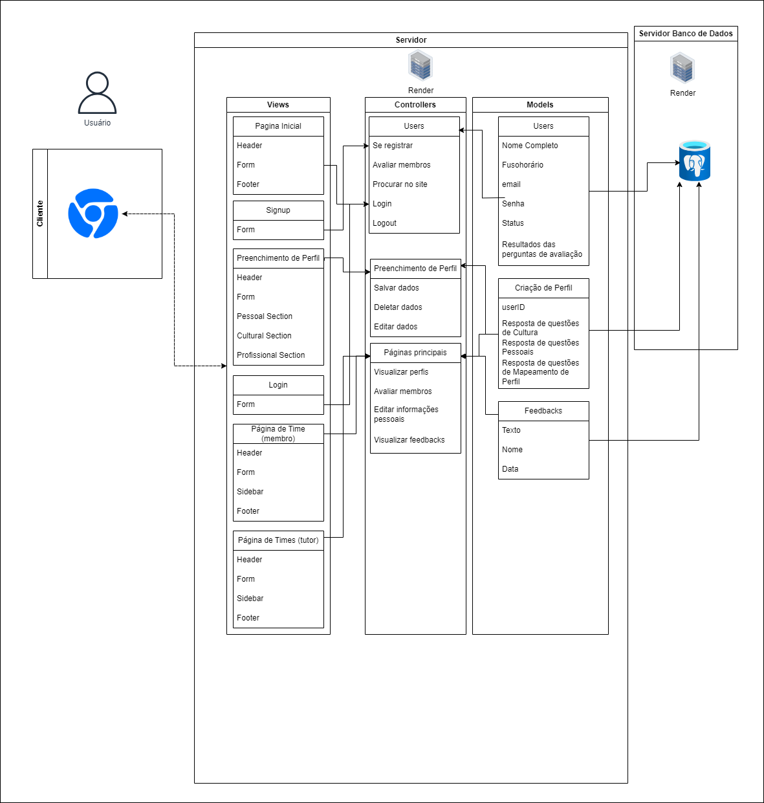

# Exemplo de Design de Arquitetura

# Arquitetura MVC em Markdown
- Nome do Projeto: TechFlex - Solução para o Cesim Game
- Descrição: Um recorte da estrutura do MVC para a plataforma web de integração cultural e mapeamento de clima organizacional entre os competidores de mesma equipe do Cesim Game
- Arquitetura: MVC (Model-View-Controller)
- Ferramenta de Diagramação: Draw.io

### Modelos (Models):
- **Users**

As informações que serão salvas dos usuários serão seus:

Nome completo;

Fusohorário;

Email;

Senha;

Status;

Resultados das perguntas de avaliação;

- **Criação de Perfil**

As informações que serão salvas referentes a criação de perfil serão:

userID;

Resposta de questões de Cultura;

Resposta de questões Pessoais;

Resposta de questões de Mapeamento de Perfil.

- **Feedbacks**

As informações que serão salvas referentes aos feedbacks serão:

Texto (dos comentários);

Nome (de quem acabou enviou o feedback);

Data (para ser possível identificar a quanto tempo foi feito o feedback);

### Controladores (Controllers):

Usuários (Users): Gerenciam ações como registro, avaliação, busca no site, login e logout.

Preenchimento de Perfil: Salvam, deletam e editam informações dos perfis dos usuários que estão criando contas.

Páginas principais: Permitem a visualização e edição de perfis, avaliação de membros e visualização de feedbacks enquanto os usuários estiverem nas páginas principais da aplicação (páginas de times).

Controllers recebem dados das Views, como formulários preenchidos, e interagem com os Models para atualizar o banco de dados. Os resultados são então enviados de volta para as Views para atualização da interface.

### Views (Views):
Homepage: Exibe a página inicial com os componentes essenciais.

Signup: Oferece um formulário de cadastro para novos usuários.

Preenchimento de Perfil: Permite aos usuários fornecerem informações detalhadas em várias seções.

Login: Fornece a autenticação de usuários.

Página de Time (membro e tutor): Apresenta uma visão adaptada para membros e tutores da equipe.

### Infraestrutura:

A infraestrutura se baseia em servidores web para a execução da lógica de Controllers e renderização das Views, juntamente com servidores de banco de dados dedicados para gerenciar as informações dos Models. Utilizamos o Sails.js para facilitar a implementação do MVC e o Draw.io para diagramação da estrutura do projeto.

#### Implicações da Arquitetura:
A escolha da arquitetura MVC permite escalabilidade, facilitando a distribuição de cargas entre os componentes. A separação clara entre a lógica de negócios, interface do usuário e processamento de dados simplifica a manutenção e promove a testabilidade de cada componente de forma isolada.

### Recursos Adicionais:
- Documentação do Sails.js: https://github.com/balderdashy/sails
- Tutorial do draw.io: https://m.youtube.com/watch?v=w3zm-wbmlpc
- Exemplos de diagramas MVC: https://www.lucidchart.com/pages/templates

